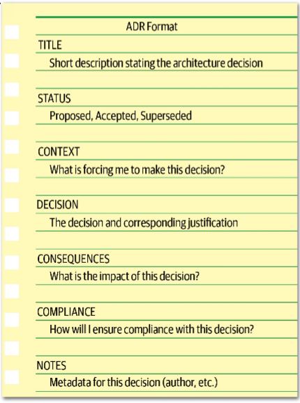
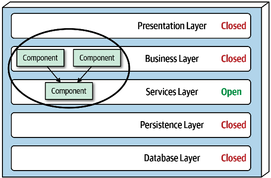
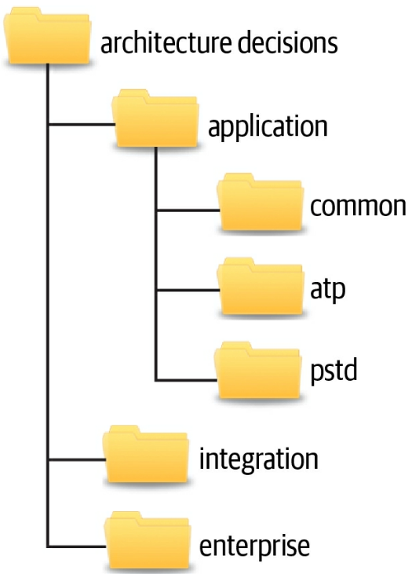

# Architectural Decision Records

One of the most effective ways of documenting architecture decisions is through Architecture Decision Records (ADRs). ADRs were first evangelized by Michael Nygard in a blog post and later marked as “adopt” in the ThoughtWorks Technology Radar. An ADR consists of a short text file (usually one to two pages long) describing a specific architecture decision. While ADRs can be written using plain text, they are usually written in some sort of text document format like AsciiDoc or Markdown. Alternatively, an ADR can also be written using a wiki page template.

Tooling is also available for managing ADRs. Nat Pryce, coauthor of Growing Object-Oriented Software Guided by Tests (Addison-Wesley), has written an open source tool for ADRs called ADR-tools. ADR-tools provides a command-line interface to manage ADRs, including the numbering schemes, locations, and superseded logic. Micha Kops, a software engineer from Germany, has written a blog post about using ADR-tools that provides some great examples on how they can be used to manage architecture decision records.

## Basic Structure

The basic structure of an ADR consists of five main sections: *Title, Status, Context, Decision,* and *Consequences*. We usually add two additional sections as part of the basic structure: *Compliance* and *Notes*. This basic structure (as illustrated below) can be extended to include any other section deemed needed, providing the template is kept both consistent and concise. A good example of this might be to add an Alternatives section if necessary to provide an analysis of all the other possible alternative solutions.



### Title

The title of an ADR is usually numbered sequentially and contains a short phrase describing the architecture decisions. For example, the decision to use asynchronous messaging between the Order Service and the Payment Service might read: “42. Use of Asynchronous Messaging Between Order and Payment Services.” The title should be descriptive enough to remove any ambiguity about the nature and context of the decision but at the same time be short and concise.

### Status

The status of an ADR can be marked as Proposed, Accepted, or Superseded. Proposed status means the decision must be approved by either a higher-level decision maker or some sort of architectural governance body (such as an architecture review board). Accepted status means the decision has been approved and is ready for implementation. A status of Superseded means the decision has been changed and superseded by another ADR. Superseded status always assumes the prior ADR status was accepted; in other words, a proposed ADR would never be superseded by another ADR, but rather continued to be modified until accepted.

The Superseded status is a powerful way of keeping a historical record of what decisions were made, why they were made at that time, and what the new decision is and why it was changed. Usually, when an ADR has been superseded, it is marked with the decision that superseded it. Similarly, the decision that supersedes another ADR is marked with the ADR it superseded. For example, assume ADR 42 (“Use of Asynchronous Messaging Between Order and Payment Services”) was previously approved, but due to later changes to the implementation and location of the Payment Service, REST must now be used between the two services (ADR 68). The status would look as follows:

*ADR 42. Use of Asynchronous Messaging Between Order and Payment Services* 

Status: Superseded by 68 

*ADR 68. Use of REST Between Order and Payment Services*

Status: Accepted, supersedes 42

The link and history trail between ADRs 42 and 68 avoid the inevitable “what about using messaging?” question regarding ADR 68.

Another significant aspect of the Status section of an ADR is that it forces an architect to have necessary conversations with their boss or lead architect about the criteria with which they can approve an architecture decision on their own, or whether it must be approved through a higher-level architect, an architecture review board, or some other architecture governing body.

Three criteria that form a good start for these conversations are cost, cross-team impact, and security. Cost can include software purchase or licensing fees, additional hardware costs, as well as the overall level of effort to implement the architecture decision. Level of effort costs can be estimated by multiplying the estimated number of hours to implement the architecture decision by the company’s standard Full-Time Equivalency (FTE) rate. The project owner or project manager usually has the FTE amount. If the cost of the architecture decision exceeds a certain amount, then it must be set to Proposed status and approved by someone else. If the architecture decision impacts other teams or systems or has any sort of security implication, then it cannot be self-approved by the architect and must be approved by a higher-level governing body or lead architect.

Once the criteria and corresponding limits have been established and agreed upon (such as “costs exceeding $5,000 must be approved by the architecture review board”), this criteria should be well documented so that all architects creating ADRs know when they can and cannot approve their own architecture decisions.

### Context

The context section of an ADR specifies the forces at play. In other words, “what situation is forcing me to make this decision?” This section of the ADR allows the architect to describe the specific situation or issue and concisely elaborate on the possible alternatives. If an architect is required to document the analysis of each alternative in detail, then an additional Alternatives section can be added to the ADR rather than adding that analysis to the Context section. 

The Context section also provides a way to document the architecture. By describing the context, the architect is also describing the architecture. This is an effective way of documenting a specific area of the architecture in a clear and concise manner. Continuing with the example from the prior section, the context might read as follows: “The order service must pass information to the payment service to pay for an order currently being placed. This could be done using REST or asynchronous messaging.” Notice that this concise statement not only specified the scenario, but also the alternatives.

### Decision

The Decision section of the ADR contains the architecture decision, along with a full justification for the decision. Michael Nygard introduced a great way of stating an architecture decision by using a very affirmative, commanding voice rather than a passive one. For example, the decision to use asynchronous messaging between services would read “we will use asynchronous messaging between services.” This is a much better way of stating a decision as opposed to “I think asynchronous messaging between services would be the best choice.” Notice here it is not clear what the decision is or even if a decision has even been made — only the opinion of the architect is stated.

Perhaps one of the most powerful aspects of the Decision section of ADRs is that it allows an architect to place more emphasis on the why rather than the how. Understanding why a decision was made is far more important than understanding how something works. Most architects and developers can identify how things work by looking at context diagrams, but not why a decision was made. Knowing why a decision was made and the corresponding justification for the decision helps people better understand the context of the problem and avoids possible mistakes through refactoring to another solution that might produce issues.

To illustrate this point, consider an original architecture decision several years ago to use Google’s Remote Procedure Call (gRPC) as a means to communicate between two services. Without understanding why that decision was made, another architect several years later makes the choice to override that decision and use messaging instead to better decouple the services. However, implementing this refactoring suddenly causes a significant increase in latency, which in turn ultimately causes time outs to occur in upstream systems. Understanding that the original use of gRPC was to significantly reduce latency (at the cost of tightly coupled services) would have prevented the refactoring from happening in the first place.

### Consequences

The Consequences section of an ADR is another very powerful section. This section documents the overall impact of an architecture decision. Every architecture decision an architect makes has some sort of impact, both good and bad. Having to specify the impact of an architecture decision forces the architect to think about whether those impacts outweigh the benefits of the decision.

Another good use of this section is to document the trade-off analysis associated with the architecture decision. These trade-offs could be cost-based or trade-offs against other architecture characteristics (“-ilities”). For example, consider the decision to use asynchronous (fire-and-forget) messaging to post a review on a website. The justification for this decision is to significantly increase the responsiveness of the post review request from 3,100 milliseconds to 25 milliseconds because users would not need to wait for the actual review to be posted (only for the message to be sent to a queue). While this is a good justification, someone else might argue that this is a bad idea due to the complexity of the error handling associated with an asynchronous request (“what happens if someone posts a review with some bad words?”). Unknown to the person challenging this decision, that issue was already discussed with the business stakeholders and other architects, and it was decided from a trade-off perspective that it was more important to have the increase in responsiveness and deal with the complex error handling rather than have the wait time to synchronously provide feedback to the user that the review was successfully posted. By leveraging ADRs, that trade-off analysis can be included in the Consequences section, providing a complete picture of the context (and trade-offs) of the architecture decision and thus avoiding these situations.

### Compliance

The compliance section of an ADR is not one of the standard sections in an ADR, but it’s one we highly recommend adding. The Compliance section forces the architect to think about how the architecture decision will be measured and governed from a compliance perspective. The architect must decide whether the compliance check for this decision must be manual or if it can be automated using a fitness function. If it can be automated using a fitness function, the architect can then specify in this section how that fitness function would be written and whether there are any other changes to the code base are needed to measure this architecture decision for compliance.

For example, consider the following architecture decision within a traditional n-tiered layered architecture as illustrated below. All shared objects used by business objects in the business layer will reside in the shared services layer to isolate and contain shared functionality.



This architecture decision can be measured and governed automatically by using either ArchUnit in Java or NetArchTest in C#. For example, using ArchUnit in Java, the automated fitness function test might look as follows:

```java
@Test
public void shared_services_should_reside_in_services_layer() {
    classes().that().areAnnotatedWith(SharedService.class)
        .should().resideInAPackage("..services..")
        .because("All shared services classes used by business " +
                 "objects in the business layer should reside in the services " +
                 "layer to isolate and contain shared logic")
        .check(myClasses);
}
```

Notice that this automated fitness function would require new stories to be written to create a new Java annotation (@SharedService) and to then add this annotation to all shared classes. This section also specifies what the test is, where the test can be found, and how the test will be executed and when.

### Notes

Another section that is not part of a standard ADR but that we highly recommend adding is the Notes section. This section includes various metadata about the ADR, such as the following:

  * Original author
  * Approval date  
  * Approved by  
  * Superseded date  
  * Last modified date  
  * Modified by  
  * Last modification

Even when storing ADRs in a version control system (such as Git), additional meta-information is useful beyond what the repository can support, so we recommend adding this section regardless of how and where ADRs are stored.

## Storing ADRs

Once an architect creates an ADR, it must be stored somewhere. Regardless of where ADRs are stored, each architecture decision should have its own file or wiki page. Some architects like to keep ADRs in the Git repository with the source code. Keeping ADRs in a Git repository allows the ADR to be versioned and tracked as well. However, for larger organizations we caution against this practice for several reasons. First, everyone who needs to see the architecture decision may not have access to the Git repository. Second, this is not a good place to store ADRs that have a context outside of the application Git repository (such as integration architecture decisions, enterprise architecture decisions, or those decisions common to every application). For these reasons we recommend storing ADRs either in a wiki (using a wiki template) or in a shared directory on a shared file server that can be accessed easily by a wiki or other document rendering software. The figure below shows an example of what this directory structure (or wiki page navigation structure) might look like.



The *application* directory contains those architecture decisions that are specific to some sort of application context. This directory is subdivided into further directories. The *common* subdirectory is for architecture decisions that apply to all applications, such as “All framework-related classes will contain an annotation (@Framework in Java) or attribute ([Framework] in C#) identifying the class as belonging to the underlying framework code.” Subdirectories under the *application* directory correspond to the specific application or system context and contain the architecture decisions specific to that application or system (in this example, the ATP and PSTD applications). The *integration* directory contains those ADRs that involve the communication between application, systems, or services. Enterprise architecture ADRs are contained within the *enterprise* directory, indicating that these are global architecture decisions impacting all systems and applications. An example of an enterprise architecture ADR would be “All access to a system database will only be from the owning system,” thus preventing the sharing of databases across multiple systems.

When storing ADRs in a wiki (the recommended approach), the same structure previously described applies, with each directory structure representing a navigational landing page. Each ADR would be represented as a single wiki page within each navigational landing page (Application, Integration, or Enterprise).

The directory or landing page names indicated in this section are only a recommendation. Each company can choose whatever names fit their situation, as long as those names are consistent across teams.

## ADRs as Documentation

Documenting software architecture has always been a difficult topic. While some standards are emerging for diagramming architecture (such as software architect Simon Brown’s C4 Model or The Open Group ArchiMate standard), no such standard exists for documenting software architecture. That’s where ADRs come in.

Architecture Decision Records can be used an an effective means to document a software architecture. The Context section of an ADR provides an excellent opportunity to describe the specific area of the system that requires an architecture decision to be made. This section also provides an opportunity to describe the alternatives. Perhaps more important is that the Decision section describes the reasons why a particular decision is made, which is by far the best form of architecture documentation. The Consequences section adds the final piece to the architecture documentation by describing additional aspects of a particular decision, such as the trade-off analysis of choosing performance over scalability.

## Using ADRs for Standards

Very few people like standards. Most times standards seem to be in place more for controlling people and the way they do things than anything useful. Using ADRs for standards can change this bad practice. For example, the Context section of an ADR describes the situation that is forcing the particular standard. The Decision section of an ADR can be used to not only indicate what the standard is, but more importantly why the standard needs to exist. This is a wonderful way of being able to qualify whether the particular standard should even exist in the first place. If an architect cannot justify the standard, then perhaps it is not a good standard to make and enforce. Furthermore, the more developers understand why a particular standard exists, the more likely they are to follow it (and correspondingly not challenge it). The Consequences section of an ADR is another great place an architect can qualify whether a standard is valid and should be made. In this section the architect must think about and document what the implications and consequences are of a particular standard they are making. By analyzing the consequences, the architect might decide that the standard should not be applied after all.


